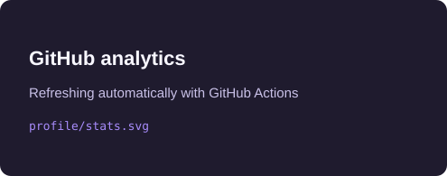
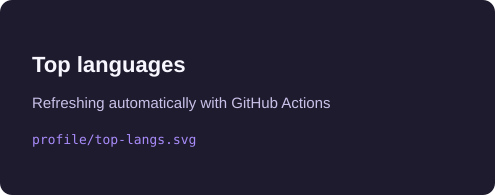

<div align="center">

<h1>Pravesh Pandey</h1>

<h3>Software Development Engineer · Amazon Alexa AI</h3>

Distributed systems, AI infrastructure, and backend services that hold up in production.

<p>
  <a href="https://pravesh-pandey.github.io/Portfolio/"><strong>Live portfolio</strong></a>
  ·
  <a href="https://pravesh-pandey.github.io/Portfolio/resume.pdf"><strong>Resume</strong></a>
  ·
  <a href="https://www.linkedin.com/in/pravesh25/"><strong>LinkedIn</strong></a>
  ·
  <a href="mailto:pravesh25pandey@gmail.com"><strong>Contact</strong></a>
</p>

<p>
  
  
  
  
</p>

</div>

## The idea

This repository is the source for my personal portfolio: a warm, editorial-style React experience for sharing engineering work, measurable outcomes, and ways to collaborate.

I like the space where reliable software meets useful intelligence — from distributed backend services and data platforms to computer vision experiments and robotics.

## What I build

| Focus | What that looks like |
| --- | --- |
| **Systems & backend** | Microservices, APIs, event-driven design, observability, and performance work |
| **AI & data** | NLU infrastructure, RAG workflows, computer vision, data processing, and automation |
| **Product delivery** | Responsive interfaces, clear user journeys, CI/CD, and production-minded iteration |

## Impact snapshot

| Signal | Result |
| --- | ---: |
| Alexa CET failure rate | **60% → 0%** for onboarded expert teams |
| Engineering effort saved | **260 hours** across 60+ teams |
| Compute cost reduction | **15%** across 9 migrated services |
| Database retrieval improvement | **68% faster** through parallel processing |

## Featured work

- **LangForge Automation** — an end-to-end Alexa AI automation system that won the AIDo Frugal Frontrunner Award.
- **AI Sudoku Solver** — camera-based puzzle recognition and solving with TensorFlow, OpenCV, and constraint satisfaction.
- **TamperScripts** — browser automation utilities, including price tracking, shortlink bypassing, and Codeforces helpers.
- **Cell Phone Controlled Car** — a Wi-Fi-controlled robotics project using Arduino, NodeMCU, and smartphone motion data.

## Technology map

<div align="center">


</div>

## GitHub analytics

These cards are generated into this repository by [GitHub Actions](.github/workflows/update-readme-analytics.yml), so the README does not depend on the shared public stats endpoint at render time.

<div align="center">
  
  
</div>

<p align="center">
  <a href="https://github.com/pravesh-pandey?tab=repositories"></a>
  <a href="https://github.com/pravesh-pandey?tab=followers"></a>
  <a href="https://github.com/pravesh-pandey/Portfolio"></a>
</p>

## Run it locally

```bash
git clone https://github.com/pravesh-pandey/Portfolio.git
cd Portfolio

# Frontend
cd client
npm install
npm run dev
```

The frontend runs on `http://localhost:5173`. The Express API lives in `server/` and runs separately when form submissions need to be tested locally.

## Project shape

```text
client/   React + Vite single-page portfolio
server/   Express API for contact and project-brief submissions
profile/  GitHub analytics SVGs refreshed by Actions
```

## Deployment

- **Frontend:** GitHub Pages — [pravesh-pandey.github.io/Portfolio](https://pravesh-pandey.github.io/Portfolio/)
- **Backend:** Vercel serverless API
- **Automation:** GitHub Actions for linting, builds, Pages deployment, and README analytics

See [Deployment.md](Deployment.md) for environment variables, CI details, and hosting setup.

<div align="center">

_Keep building. Keep learning. Keep shipping._

</div>
